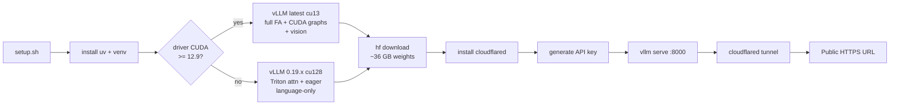

<div align="center">

# Qwen3.6-35B-A3B-FP8 · RunPod Deploy

**One-script deploy of Alibaba's 35B MoE on a single Blackwell GPU.**
OpenAI-compatible API, public HTTPS endpoint, agent-grade tool calling — in under 10 minutes.

[](https://www.apache.org/licenses/LICENSE-2.0)
[](https://huggingface.co/Qwen/Qwen3.6-35B-A3B-FP8)
[](https://docs.vllm.ai)
[](https://www.nvidia.com)
[](#tested-configurations)

[Quickstart](#1-quickstart) · [API usage](#3-call-the-api-from-your-app) · [Compatibility](#5-compatibility-matrix) · [Troubleshooting](#7-troubleshooting) · [Full reference](./QWEN_API.md)

</div>

---

## At a glance

| | |
|---|---|
| **Model** | `Qwen/Qwen3.6-35B-A3B-FP8` (35B params, 3B activated, FP8) |
| **Context** | 131,072 tokens (native 262,144 supported with YaRN) |
| **GPU** | 1× NVIDIA RTX PRO 6000 Blackwell (96 GB VRAM) |
| **Disk** | ~36 GB model weights · ~5 GB venv |
| **VRAM at runtime** | ~36 GB weights · ~40 GB KV cache (FP8) · headroom for ~940K cached tokens |
| **Public URL** | Free Cloudflare quick tunnel, HTTPS, no domain required |
| **Setup time** | ~6–10 minutes from `git clone` to first token |
| **Cost** | $0 software · pay only RunPod GPU hours (~$2.50/h current rate) |

---

## 1. Quickstart

### On a fresh RunPod container

```bash
git clone https://github.com/X4ndar/qwen-3.6-35B.git
cd qwen-3.6-35B
./setup.sh
```

When it finishes you'll see:

```
============================================================
  Public URL : https://random-words.trycloudflare.com/v1
  API key    : sk-qwen-...
  Model      : Qwen/Qwen3.6-35B-A3B-FP8
  Docs       : /workspace/QWEN_API.md
  CLI        : qwen [args...]
============================================================
```

### Verify it works

```bash
qwen --no-think "Reply with: deploy ok"
# → deploy ok
```

That's it. The endpoint is reachable from anywhere on the public internet.

---

## 2. What the script actually does



The driver auto-detection means **the same script works on any pod**. Old driver pods get a slightly slower but functional setup; modern pods get the full performance + vision profile automatically.

---

## 3. Call the API from your app

The endpoint is a drop-in for OpenAI's Chat Completions. Set two env vars and use any OpenAI SDK.

### Bash · curl

```bash
export OPENAI_BASE_URL="https://random-words.trycloudflare.com/v1"
export OPENAI_API_KEY="sk-qwen-..."

curl -s "$OPENAI_BASE_URL/chat/completions" \
  -H "Authorization: Bearer $OPENAI_API_KEY" \
  -H "Content-Type: application/json" \
  -d '{
    "model": "Qwen/Qwen3.6-35B-A3B-FP8",
    "messages": [{"role":"user","content":"Hello"}],
    "chat_template_kwargs": {"enable_thinking": false}
  }'
```

### Python · OpenAI SDK

```python
from openai import OpenAI
client = OpenAI()  # picks up env vars

r = client.chat.completions.create(
    model="Qwen/Qwen3.6-35B-A3B-FP8",
    messages=[{"role": "user", "content": "Hello"}],
    extra_body={"chat_template_kwargs": {"enable_thinking": False}},
)
msg = r.choices[0].message
print(msg.content or msg.reasoning)   # see §7 of QWEN_API.md for the why
```

### TypeScript · OpenAI SDK

```ts
import OpenAI from "openai";

const client = new OpenAI();
const r = await client.chat.completions.create({
  model: "Qwen/Qwen3.6-35B-A3B-FP8",
  messages: [{ role: "user", content: "Hello" }],
  // @ts-expect-error vLLM extension
  chat_template_kwargs: { enable_thinking: false },
} as any);
const msg = r.choices[0].message as any;
console.log(msg.content ?? msg.reasoning);
```

Tool calling, image input, sampling presets, and the verified `preserve_thinking` agent pattern are all covered in [`QWEN_API.md`](./QWEN_API.md).

---

## 4. CLI on the pod

```bash
qwen                              # interactive REPL with token streaming
qwen "your prompt"                # one-shot
qwen --no-think "fast reply"      # skip thinking → ~3× faster
qwen --think "hard problem"       # show dimmed reasoning trace
qwen --preserve-thinking          # agent mode: keep reasoning across turns
qwen --system "you are a..." "..." # set system prompt
```

REPL slash commands: `/reset`, `/system <text>`, `/think on|off`, `/quit`.

---

## 5. Compatibility matrix

The setup script auto-selects the right profile. Reference table:

| Driver | CUDA reported | vLLM build | Attention | CUDA graphs | Vision | Notes |
|---|---|---|---|---|---|---|
| **≥ 580.x** | 13.0+ | latest (`cu13`) | FlashAttention 2/3 | yes | yes | Full performance, recommended |
| **570.x** | 12.8 | `0.19.1` (`cu128`) | Triton (JIT) | no (`--enforce-eager`) | no (`--language-model-only`) | Auto-applied legacy profile |
| **< 570** | < 12.8 | unsupported | — | — | — | Pick a newer pod template |

### What "legacy profile" costs you

| Aspect | Cost |
|---|---|
| Throughput | ~10–20 % slower decode (eager + Triton attn) |
| Vision input | Disabled — text + tool calling only |
| Otherwise | Tool calling, thinking modes, MTP, FP8 KV cache, reasoning parser all work identically |

---

## 6. Operations

### Repo / pod file map

| Path | Purpose |
|---|---|
| `setup.sh`            | Full deploy from scratch (idempotent — safe to re-run) |
| `start-vllm.sh`       | Restart just vLLM (uses existing key + weights) |
| `start-tunnel.sh`     | Restart Cloudflare tunnel (URL changes!) |
| `chat.py`             | Streaming REPL client |
| `QWEN_API.md`         | Full API reference |
| `/workspace/.qwen-api-key` | Generated per pod, mode 600 |
| `/workspace/models/Qwen3.6-35B-A3B-FP8/` | 36 GB weights |
| `/workspace/.venv-vllm/` | Python venv |
| `/workspace/logs/vllm-serve.log` | vLLM logs |
| `/workspace/logs/cloudflared.log` | Tunnel logs (the public URL is in here) |

### Common tasks

```bash
# What's the public URL right now?
grep -oE "https://[a-z0-9-]+\.trycloudflare\.com" /workspace/logs/cloudflared.log | head -1

# What's the API key?
cat /workspace/.qwen-api-key

# Are both processes alive?
ps -ef | grep -E "(vllm serve|cloudflared)" | grep -v grep

# Restart vLLM only (keeps tunnel + URL)
./start-vllm.sh

# Restart tunnel only (URL will change)
./start-tunnel.sh
```

### Re-running setup.sh

`setup.sh` is idempotent:
- Existing venv → reused
- Existing weights → not re-downloaded
- Existing API key → kept (set `API_KEY=...` env to force a new one)
- Running vLLM → killed before restart

---

## 7. Troubleshooting

<details>
<summary><b>vLLM crashes with <code>cudaErrorUnsupportedPtxVersion</code></b></summary>

The vLLM 0.20+ wheel ships PTX compiled against CUDA 12.9+. On driver 570.x (CUDA 12.8 max), the GPU's PTX JIT can't load it.

The script handles this automatically by pinning vLLM `>=0.19.0,<0.20` and installing `cu128` torch wheels on legacy drivers. If you bypassed the script and hit this manually, run:

```bash
source /workspace/.venv-vllm/bin/activate
uv pip install --reinstall "vllm>=0.19.0,<0.20" --torch-backend=cu128
```
</details>

<details>
<summary><b>"Free memory on device cuda:0 is less than desired GPU memory utilization"</b></summary>

A previous vLLM crashed but its CUDA context wasn't released. Find and kill the orphan:

```bash
nvidia-smi --query-compute-apps=pid,process_name,used_memory --format=csv
kill -9 <orphan-pid>
```
</details>

<details>
<summary><b>Public URL changed after restart</b></summary>

Cloudflare quick tunnels assign a fresh random subdomain whenever `cloudflared` restarts. To find the new one:

```bash
grep -oE "https://[a-z0-9-]+\.trycloudflare\.com" /workspace/logs/cloudflared.log | head -1
```

For a stable URL, switch to a Cloudflare Named Tunnel (needs a domain on Cloudflare DNS) or RunPod's port proxy (expose port 8000 in the pod UI).
</details>

<details>
<summary><b><code>preserve_thinking</code> doesn't seem to work — token count doesn't grow</b></summary>

Use the `reasoning` field in the assistant message, **not** `reasoning_content` (vLLM's API silently drops it):

```python
history.append({
    "role": "assistant",
    "content": msg.content or "",
    "reasoning": msg.reasoning or "",   # this field survives
})
```

Verify by checking that turn-2 `usage.prompt_tokens` grows by roughly *(turn-1 reasoning + turn-1 content)* tokens. Full investigation in [`QWEN_API.md` §7](./QWEN_API.md).
</details>

<details>
<summary><b>The model returns the answer in <code>reasoning</code>, not <code>content</code></b></summary>

That's `--reasoning-parser qwen3` doing its job. When `enable_thinking: true`, the chain-of-thought goes to `reasoning` and the final answer to `content`. When `enable_thinking: false` and the parser sees no closing `</think>` tag, it routes the entire reply through `reasoning`.

**Safe one-liner that works in both modes:**

```python
answer = msg.content or msg.reasoning
```
</details>

---

## 8. Tested configurations

| Pod | GPU | Driver | CUDA | Profile | Result |
|---|---|---|---|---|---|
| RunPod (us-nc-1) | RTX PRO 6000 Blackwell 96 GB | 580.126.09 | 13.0 | modern | works, full perf + vision |
| RunPod (us-nc-2) | RTX PRO 6000 Blackwell 96 GB | 570.195.03 | 12.8 | legacy | works, text + tools, no vision |

---

## 9. What's NOT in this repo

- `/workspace/.qwen-api-key` — generated per pod, mode 600, never committed
- `/workspace/models/Qwen3.6-35B-A3B-FP8/` — 36 GB of weights, downloaded on demand
- `/workspace/logs/` — runtime logs

---

## License

- Setup scripts and helper code: **MIT**
- Model weights: **Apache-2.0** (Qwen team, [model card](https://huggingface.co/Qwen/Qwen3.6-35B-A3B-FP8))
- vLLM: **Apache-2.0**
- cloudflared: **Apache-2.0**

---

<div align="center">

Built with [vLLM](https://docs.vllm.ai), [Cloudflare Tunnel](https://developers.cloudflare.com/cloudflare-one/connections/connect-networks/), and [uv](https://astral.sh/uv).

</div>
